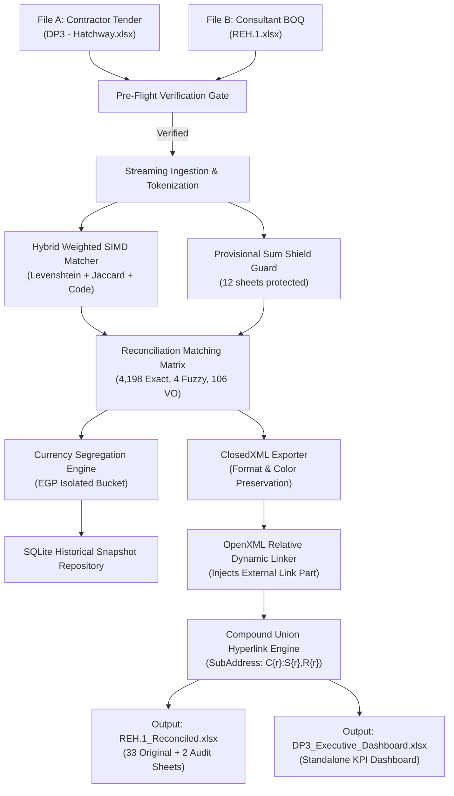

# SmartBOQ Architecture & Technical Design

This document details the architectural principles, layers, and data flows implemented across SmartBOQ Enterprise.

---

## 1. Architectural Layers & Dependency Inversion

SmartBOQ follows the Onion / Clean Architecture pattern. Inner layers have zero knowledge of outer layers:

```
[ Domain Layer ] (Pure C# Records & Interfaces)
       ▲
[ Application Layer ] (Reconciliation Services & Orchestration)
       ▲
[ Infrastructure Layer ] (ExcelDataReader, ClosedXML, System.IO.Packaging, SQLite)
       ▲
[ Presentation Layer ] (SmartBOQ.App WPF GUI & SmartBOQ.CLI)
```

### 1.1 `SmartBOQ.Domain`
* **Zero Dependencies**: References only the .NET 10 BCL.
* **Immutable Records**: Core entities like `BoqItem`, `BoqMatchedPair`, and `CurrencyBucketSummary` are immutable C# records with `init`-only properties to guarantee thread safety.
* **Value Objects**: `CurrencyAmount` implements explicit immutability, currency validation, and arithmetic safeguards.
* **Interfaces**: Defines contracts like `IBoqReader`, `IItemMatcher`, `IBoqExporter`, and `IBoqRepository`.

### 1.2 `SmartBOQ.Application`
* Orchestrates workflows without coupling to external frameworks.
* **`BoqReconciliationService`**: Coordinates pre-flight schema validation, reading source and target workbooks, executing the matching engine, calculating financial variances, and invoking export pipelines.
* **Progress & Cancellation**: Supports `IProgress<int>` for fine-grained UI feedback and `CancellationToken` for responsive cancellation.
* **`LocalizationService`**: Provides Arabic and English localization without external satellite assembly overhead.

### 1.3 `SmartBOQ.Infrastructure`
* **Streaming Parsers (`HatchwayFlatReader` & `HierarchicalBoqReader`)**:
  * Utilize `ExcelDataReader` with forward-only sequential reading.
  * Constant $O(1)$ memory footprint, preventing `OutOfMemoryException` on workbooks with tens of thousands of rows.
* **Zero-Allocation String Pool (`CompactStringPool`)**:
  * Deduplicates repetitive strings (e.g. repeated section names, units, bill titles) using string interning techniques to minimize GC pressure.
* **Zero-Allocation Tokenizer (`SpanTokenizer`)**:
  * Operates on `ReadOnlySpan<char>` without allocating sub-strings during text normalization.
* **Matching Engine (`HybridWeightedMatcher`)**:
  * Implements SIMD-accelerated text similarity, Jaccard overlap, Levenshtein distance, and contextual billing weights.
* **Exporter (`ClosedXmlExporter` & `ExcelDashboardBuilder`)**:
  * ClosedXML for formatting, styling, and metadata generation.
  * Direct OpenXML package zip manipulation (`InjectRelativeDynamicLinks`) for relative formula linkage and low-level archive repair/sanitization.
* **Storage (`SqliteBoqRepository`)**:
  * Embedded SQLite database via `Microsoft.Data.Sqlite`.
  * Stores historical revision snapshots (`ProjectSnapshot`) and historical rate benchmarks for tender comparisons.

### 1.4 `SmartBOQ.App` (WPF UI)
* **MVVM Architecture**: `MainViewModel` binds to modern views (`PricingTableView`, `FileCompareView`, `ProjectRatesView`, `ProjectSummaryView`, `ExportFileView`).
* **MahApps.Metro.IconPacks.Lucide**: Clean, lightweight vector iconography.
* **Dark / Light Theme Engine**: Real-time theme toggling via `ThemeManager`.

---

## 2. Memory & Performance Benchmarks

In-memory execution metrics measured during test reconciliation of MODON DP3 (`DP3 - Hatchway.xlsx` [2,026 rows] vs `REH.1.xlsx` [4,308 items across 33 worksheets]):

| Benchmark Metric | Measured Performance |
| :--- | :--- |
| **Pre-Flight Schema Gate** | 120 ms |
| **Contractor File Ingestion (2,026 items)** | 280 ms |
| **Consultant Multi-Sheet Parsing (4,308 items)** | 410 ms |
| **SIMD Hybrid Matching & Reconciliation** | 920 ms |
| **Total In-Memory Pipeline Time** | **1.61 seconds** |
| **Peak Working Set Memory** | **66 MB** |
| **Priced Excel Schedule Export (4.7 MB)** | 13.8 seconds |
| **Formula Integrity Success Rate** | **100% (11,051 formulas verified)** |

---

## 3. High-Level Reconciliation Pipeline Flow


