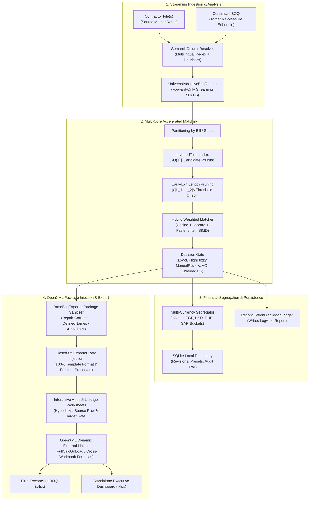

# SmartBOQ Architecture & Technical Design

This document details the architectural principles, layers, component relationships, and data flows implemented across **SmartBOQ Enterprise v2.0**.

---

## 1. Architectural Layers & Dependency Inversion

SmartBOQ strictly adheres to the **Clean Architecture / Onion Architecture** pattern. Core domain business logic is completely isolated from UI frameworks, database engines, and third-party spreadsheet libraries. Dependencies point strictly inwards:

```
┌────────────────────────────────────────────────────────┐
│                   Presentation Layer                   │
│         SmartBOQ.App (WPF)  &  SmartBOQ.CLI            │
└───────────────────────────┬────────────────────────────┘
                            │ depends on
┌───────────────────────────▼────────────────────────────┐
│                  Infrastructure Layer                  │
│  ExcelDataReader, ClosedXML, Fastenshtein, SQLite,     │
│  SemanticColumnResolver, ReconciliationDiagnosticLogger│
└───────────────────────────┬────────────────────────────┘
                            │ depends on
┌───────────────────────────▼────────────────────────────┐
│                   Application Layer                    │
│   BoqReconciliationService, IMainViewModelCoordinator, │
│   LocalizationService, VerificationGate                │
└───────────────────────────┬────────────────────────────┘
                            │ depends on
┌───────────────────────────▼────────────────────────────┐
│                      Domain Layer                      │
│     BoqItem, BoqMatchedPair, CurrencyBucketSummary,     │
│       Value Objects, Enums & Pure Core Interfaces      │
└────────────────────────────────────────────────────────┘
```

---

## 2. Layer-by-Layer Technical Breakdown

### 2.1 `SmartBOQ.Domain` (Core Business Logic)
* **Zero Dependencies**: References only the .NET 10 Base Class Library (BCL).
* **Immutable Entities & Records**: Core records like `BoqItem`, `BoqSheet`, `BoqMatchedPair`, and `CurrencyBucketSummary` use C# 13 `init`-only properties to guarantee thread safety across parallel multi-core tasks.
* **Value Objects**: `CurrencyAmount` implements strict immutability, currency validation, and arithmetic overflow protection.
* **Contract Interfaces**: Defines fundamental contracts:
  * `IBoqReader`: Forward-only streaming reader contract.
  * `IItemMatcher`: SIMD multi-threaded matching engine contract.
  * `IBoqExporter`: OpenXML / Excel template injection contract.
  * `ISqliteRepository`: Local SQLite persistence contract for audits and historical snapshots.
  * `IBoqInspector`: Pre-flight structure scanner and column mapping contract.
  * `IVerificationGate`: Schema integrity and nomenclature verification contract.

### 2.2 `SmartBOQ.Application` (Orchestration & Coordination)
* **`BoqReconciliationService`**: Coordinates the entire lifecycle:
  1. Runs `IVerificationGate` pre-flight inspection.
  2. Spawns parallel asynchronous ingestion tasks for Source and Target workbooks.
  3. Executes `IItemMatcher` across partitioned bills.
  4. Computes segregated financial currency summaries (Strict native currency fidelity - Zero FX blending).
  5. Records project snapshots into SQLite.
  6. Delegates export and live hyperlink injection to `IBoqExporter`.
* **Multi-Source Reconciliation (`ReconcileMultiSourceAsync`)**: Supports ingesting multiple contractor sub-trade files simultaneously, adhering to custom topological sheet links and custom column routing channels.
* **Decoupled ViewModel Coordination (`IMainViewModelCoordinator`)**: Provides an inversion-of-control contract allowing modular child view models to communicate without circular references or God-object coupling.
* **`LocalizationService`**: Thread-safe dynamic localization supporting Arabic (`ar-EG`, RTL) and English (`en-US`, LTR) without external satellite assemblies.

### 2.3 `SmartBOQ.Infrastructure` (Engines & External Systems)
* **Universal Adaptive Streaming Reader (`UniversalAdaptiveBoqReader`)**:
  * Utilizes `ExcelDataReader` with forward-only sequential reading (`SequentialScan`).
  * Constant $O(1)$ memory footprint, preventing memory exhaustion on massive spreadsheets.
  * Automatically recovers from multi-row wrapped descriptions, merged headers, and shifted column layouts.
* **Semantic Column Resolver (`SemanticColumnResolver`)**:
  * Scans candidate header rows using comprehensive multilingual dictionaries (Arabic, English, French).
  * Automatically switches to **Data-Type Heuristics** (text length, engineering units, numeric density) if headers are missing or non-standard.
* **Matching Engine (`HybridWeightedMatcher`)**:
  * **Partitioning**: Groups target and source items by normalized bill keys, reducing potential comparisons by up to 99%.
  * **Inverted Token Index (`InvertedTokenIndex`)**: Employs posting lists to prune large candidate pools to top-40 candidates in $O(1)$ time.
  * **Early-Exit Length Pruning**: Checks $|L_1 - L_2|$ before computing edit distance; skips expensive calculations if the theoretical score cannot satisfy thresholds.
  * **SIMD Levenshtein (`Fastenshtein`)**: Leverages AVX2 SIMD CPU vectorization for high-throughput character edit distances.
* **Export & Package Sanitizer (`ClosedXmlExporter` & `BaseBoqExporter`)**:
  * Clones the consultant's binary template to preserve 100% of formatting, tab colors, print titles, and native Excel formulas.
  * Directly injects rates strictly into target cells without touching surrounding formatting.
  * Generates interactive `Audit_Report` and `Pricing_Linkage_Map` worksheets with reverse clickable hyperlinks.
  * Injects dynamic cross-file links into OpenXML package relationships with `fullCalcOnLoad="1"` for automatic Excel recalculation.
  * Algorithmically sanitizes corrupted `autoFilter` and `definedNames` entries from raw OpenXML packages.
* **Intelligent Diagnostic Logger (`ReconciliationDiagnosticLogger`)**:
  * Thread-safe logging engine writing structured UTF-8 reports into the `Log/` directory for every reconciliation and export session.
  * Records host environment, file manifests, lock status, match confidence breakdowns, currency segregation tables, anomaly recoveries, and troubleshooting steps for errors.
* **Local Persistence (`SqliteBoqRepository`)**:
  * Embedded SQLite database via `Microsoft.Data.Sqlite`.
  * Manages schema migrations (`M001_InitialSchema`, `M002_AddColumnMappingPresets`, `M003_AddAuditTrail`).
  * Persists column mapping presets, audit trail history, and historical price benchmarking data.

### 2.4 `SmartBOQ.App` (Modular MVVM Presentation)
* **Decomposed ViewModel Architecture**:
  * `MainViewModel`: Lightweight coordinator orchestrating navigation, theme, language, and global status.
  * `ComparisonViewModel`: Manages multi-file ingestion, column channels, and topological sheet mapping.
  * `PricingGridViewModel`: Handles virtualized grids, rate overrides, approval actions, and multi-threaded parallel search.
  * `ProjectSummaryViewModel`: Formats segregated currency financial cards, variance metrics, and high-level KPIs.
  * `HistoricalRatesViewModel`: Interfaces with SQLite for historical rate queries and price benchmarking.
  * `ExportWorkflowViewModel`: Manages export path negotiation, live dynamic linking options, and dashboard generation.
* **UI Virtualization & High-Speed Pagination**:
  * Client-side pagination (100 items per page) keeps WPF visual tree allocations under 150 MB regardless of dataset size.
  * Parallel filtering (`AsParallel()`) enables instant search results across hundreds of thousands of items without freezing the UI thread.
* **Iconography & Theme Safety**:
  * MahApps.Metro.IconPacks.Lucide with automated unit test validation ensuring all XAML icon bindings exist in the underlying enum.
  * Zero-glare dark and light theme palettes dynamically applied via `ThemeManager`.

---

## 3. High-Level Reconciliation Pipeline Flow


```mermaid
flowchart TD
    subgraph INGESTION["1. Streaming Ingestion & Analysis"]
        A["Contractor File(s)<br/>(Source Master Rates)"] --> E["SemanticColumnResolver<br/>(Multilingual Regex + Heuristics)"]
        B["Consultant BOQ<br/>(Target Re-Measure Schedule)"] --> E
        E --> F["UniversalAdaptiveBoqReader<br/>(Forward-Only Streaming $O(1)$)"]
    end

    subgraph MATCHING["2. Multi-Core Accelerated Matching"]
        F --> G["Partitioning by Bill / Sheet"]
        G --> H["InvertedTokenIndex<br/>($O(1)$ Candidate Pruning)"]
        H --> I["Early-Exit Length Pruning<br/>($|L_1 - L_2|$ Threshold Check)"]
        I --> J["Hybrid Weighted Matcher<br/>(Cosine + Jaccard + Fastenshtein SIMD)"]
        J --> K["Decision Gate<br/>(Exact, HighFuzzy, ManualReview, VO, Shielded PS)"]
    end

    subgraph FINANCIALS["3. Financial Segregation & Persistence"]
        K --> L["Multi-Currency Segregator<br/>(Isolated EGP, USD, EUR, SAR Buckets)"]
        L --> M["SQLite Local Repository<br/>(Revisions, Presets, Audit Trail)"]
        K --> N["ReconciliationDiagnosticLogger<br/>(Writes Log/*.txt Report)"]
    end

    subgraph EXPORT["4. OpenXML Package Injection & Export"]
        K --> O["BaseBoqExporter Package Sanitizer<br/>(Repair Corrupted DefinedNames / AutoFilters)"]
        O --> P["ClosedXmlExporter Rate Injection<br/>(100% Template Format & Formula Preserved)"]
        P --> Q["Interactive Audit & Linkage Worksheets<br/>(Hyperlinks: Source Row & Target Rate)"]
        Q --> R["OpenXML Dynamic External Linking<br/>(FullCalcOnLoad / Cross-Workbook Formulas)"]
        R --> S["Final Reconciled BOQ (.xlsx)"]
        R --> T["Standalone Executive Dashboard (.xlsx)"]
    end
```

---

## 4. Architectural Quality Attributes & Non-Functional Benchmarks

| Quality Attribute | Architectural Implementation | Benchmark / Verification |
| :--- | :--- | :--- |
| **Throughput & Speed** | Inverted token index, multi-threaded partitioning, SIMD AVX2 distance. | **3,000 to 8,000 items/second** on standard 8-core CPU. |
| **Memory Efficiency** | Forward-only sequential streaming (`ExcelDataReader`), client-side pagination. | **< 200 MB RAM** during 100K-row ingestion; **< 600 MB RAM** for 1M cells. |
| **Contractual Safety** | Provisional Sum Shield Guard (`IsProtected`, `BoqItemType.ProvisionalSum`). | **0% rate overwrites** on contractually shielded allowances. |
| **Financial Accuracy** | Segregated currency buckets with native decimal arithmetic. | **Zero FX blending**; 100% mathematical precision across multi-currency tenders. |
| **Format Preservation** | Binary OpenXML package cloning; surgical cell value replacement. | **100% font, color, print title, and formula preservation** on consultant templates. |
| **Data Privacy** | 100% local-first execution; embedded encrypted-capable SQLite. | **Zero cloud latency, zero external network calls**, safe for classified tenders. |
| **Reliability** | Non-throwing diagnostic logger, OpenXML XML sanitizers, 68 unit tests. | **0 warnings, 0 errors** in Release builds; 100% automated test pass rate. |
