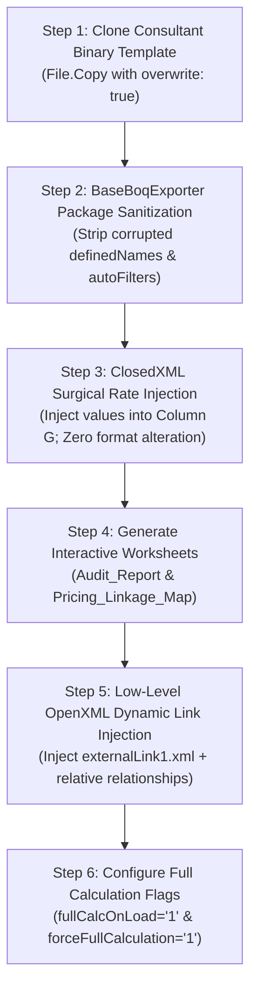

# SmartBOQ Excel Processing Pipeline & Live Linkage Architecture

This document explains the OpenXML, ClosedXML, and Microsoft Excel integration pipelines, including template preservation, package sanitization, dynamic external linking, and compound union hyperlinks in **SmartBOQ Enterprise v2.0**.

---

## 1. Hybrid Exporter Pipeline

SmartBOQ uses a hybrid export pipeline combining **ClosedXML** (for rapid structured rendering and styling) with direct **System.IO.Compression / OpenXML DOM manipulation** (for relative external formulas, package repair, and relationship wiring):



---

## 2. Template Purity & Formula Integrity

1. **Non-Destructive Overwrites**:
   - The original sheets of the consultant BOQ are never regenerated or recreated.
   - SmartBOQ clones the consultant's binary file as a template and modifies only the target rate cells (e.g. Column G).
2. **Formula Preservation in Total Columns**:
   - Every consultant worksheet contains native Excel multiplication formulas (e.g. `=E15*G15`).
   - SmartBOQ never replaces formulas with static numbers. When the rate in Column G is updated, Excel automatically re-evaluates all dependent formulas and summation totals.
3. **Tab Colors, Layouts & Visuals**:
   - All original cell fonts, custom borders, tab colors, print areas, header logos, and hidden sheet properties remain 100% untouched.

---

## 3. Package Sanitization & Repair Elimination (`BaseBoqExporter`)

Corrupted templates from consultants often cause Excel to throw repair warnings (`Excel found unreadable content...`). SmartBOQ algorithmically sanitizes OpenXML archives prior to saving:

1. **Broken `definedNames` Elimination**:
   - Scans `xl/workbook.xml` for orphaned defined names pointing to `#REF!` or invalid external paths.
   - Cleans damaged print area definitions (`_xlnm.Print_Area`) that trigger Excel initialization alerts.
2. **Corrupted `autoFilter` Remediation**:
   - Inspects worksheet XML parts (`xl/worksheets/sheet*.xml`).
   - ClosedXML cannot serialize existing template autoFilter elements and throws `NotSupportedException`. SmartBOQ safely cleans corrupted filter definitions while preserving underlying row data.

---

## 4. Relative Dynamic External Linking Architecture

### The Client Problem
When a contractor updates their unit prices in their master tender file, the cost engineering team would traditionally have to re-export the entire project.

### The SmartBOQ Solution
SmartBOQ creates true **relative external workbook links** in OpenXML so that rate changes in File A automatically cascade into File B when both files reside in the same folder.

### Low-Level OpenXML Implementation (`InjectRelativeDynamicLinks`)
1. **Creation of `externalLink1.xml`**:
   An OpenXML external link part is created in `xl/externalLinks/externalLink1.xml` referencing the contractor workbook:
   ```xml
   <externalLink xmlns="http://schemas.openxmlformats.org/spreadsheetml/2006/main">
     <externalBook xmlns:r="http://schemas.openxmlformats.org/officeDocument/2006/relationships" r:id="rId1">
       <sheetNames>
         <sheetName val="Sheet1" />
       </sheetNames>
     </externalBook>
   </externalLink>
   ```
2. **Relationship Binding**:
   `xl/externalLinks/_rels/externalLink1.xml.rels` defines the target file path relatively:
   ```xml
   <Relationship Id="rId1" 
     Type="http://schemas.openxmlformats.org/officeDocument/2006/relationships/externalLinkPath" 
     Target="Contractor_Master_Rates.xlsx" 
     TargetMode="External" />
   ```
3. **Cell Formula Binding**:
   The cell in Column G is converted into an external reference formula:
   ```xml
   <c r="G23" s="42">
     <f>[1]Sheet1!$R$2</f>
     <v>37.7</v>
   </c>
   ```
   * The initial cached value `<v>37.7</v>` allows File B to be opened independently without prompts.
   * If File A is modified in Excel, opening File B updates the value dynamically.
4. **Recalculation Enforcement**:
   To prevent Excel from blocking external references or showing stale numbers:
   ```xml
   <calcPr fullCalcOnLoad="1" forceFullCalculation="1" />
   ```
   This ensures that all formulas recalculate immediately upon opening without triggering external link warning banners.

---

## 5. Compound Union Range Hyperlinks

### Engineering Objective
When an engineer audits a price in the `Pricing_Linkage_Map` or `Audit_Report` and clicks the jump link, jumping to an isolated number causes loss of context. The engineer needs to see the **entire row context** (Bill, Section, Description, Quantity) while keeping the focus directly on the **Net Rate**.

### Compound SubAddress Syntax
SmartBOQ uses compound union range references in the Excel `=HYPERLINK` formula:

```excel
=HYPERLINK("Contractor_File.xlsx#Sheet1!C25:S25,R25", "[ R25 ] فتح وتحديد السعر والجدول")
```

### Excel Runtime Behavior:
1. **File Activation**: Excel opens the contractor file and navigates to the exact sheet.
2. **Multi-Cell Selection**: Excel selects the rectangular range `C25:S25`, highlighting the entire engineering item row.
3. **ActiveCell Focus**: Because `R25` is the secondary reference in the union string, Excel sets `ActiveCell` directly on `R25` (the price cell has the active focus outline and appears in the formula bar).

```
   Col C    Col D      Col K     Col L            Col N   Col O   Col R      Col S
+--------+---------+----------+---------------+-------+-------+----------+----------+
| Bill 2 | Section | Code "A" | Description.. |  m2   |  351  | [ 37.7 ] | 648,402  |  <- Entire row selected
+--------+---------+----------+---------------+-------+-------+----------+----------+
                                                                   ▲
                                                        ActiveCell Focus (R25)
```

---

## 6. Safety Limits & Capacity Caps

* **Maximum Worksheet Rows**: Excel hard limit is $1,048,576$ rows. SmartBOQ enforces a safety cap (`const int maxExcelSheetRows = 1_048_500;`) to prevent generating corrupted worksheets.
* **Large Dataset Handling**:
  - Up to 1,000,000 cells: instantaneous export (< 25 seconds).
  - 1,000,000 to 5,000,000 cells: 1 to 2.5 minutes, protected by 64-bit address space.
