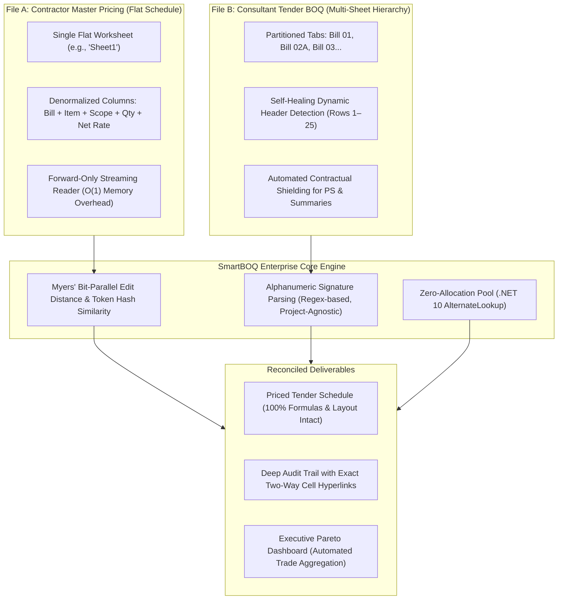

# Supported File Structures & Ingestion Standards

## 1. Executive Technical Overview

SmartBOQ Enterprise utilizes an **asymmetric dual-stream ingestion pipeline** engineered specifically for Tier-1 civil, infrastructure, and MEP engineering contracts. The engine ingests two distinct types of Excel workbooks:

1. **File A (The Pricing Source):** The Contractor’s Master Pricing Schedule — structured as a denormalized, high-throughput **Flat Tabular Matrix**.
2. **File B (The Tender Target):** The Consultant’s Contractual Bill of Quantities (BOQ) — structured as a **Hierarchical, Multi-Worksheet Workbook** complete with live calculation trees, cross-sheet references, and summary rollups.



---

## 2. File A Specification: Contractor Master Rates Schedule (Flat Table)

### Purpose & Architecture
File A provides the approved commercial rate repository. The reader (`HatchwayFlatReader`) processes this file via streaming `ExcelDataReader` with continuous $O(1)$ memory footprint regardless of file size (tested up to 500,000+ rows).

### Structural Requirements
* **Worksheet Layout:** Data resides in the primary data tab (e.g., `Sheet1` or the first available sheet).
* **Row Granularity:** One priced scope line item per row. Blank separator rows are automatically skipped.
* **Row 1 Metadata Scan:** The reader inspects row 1 across all columns to extract the **Contract Currency** (`EGP`, `USD`, `EUR`, `SAR`, etc.) to enforce strict zero-blending currency isolation.

### Standard Column Schema

| Column Index | Field Name | Type | Mandatory? | Description & Semantics |
| :--- | :--- | :--- | :---: | :--- |
| **Col 2 (C)** | `Bill Name` | String | **Yes** | Bill or Package identifier (e.g., `Bill 02A-3BR Villa East`, `Bill 05-Infra`). Rows not starting with standard bill signatures are safely bypassed. |
| **Col 3–4 (D–E)** | `Section / Sub-Section` | String | No | Trade or structural level (e.g., `Earthworks > Excavation`). Combined into a composite hierarchy path. |
| **Col 10 (K)** | `Item Code` | String | No | Bill item code / alphanumeric reference (e.g., `A`, `1.01`, `C.02`). |
| **Col 11 (L)** | `Description` | String | **Yes** | Detailed engineering specification text. Normalized and tokenized for Bit-Parallel Levenshtein matching. |
| **Col 13 (N)** | `Unit (UOM)` | String | **Yes** | Standard engineering unit of measurement (`m2`, `m3`, `t`, `nr`, `item`, `lm`, etc.). |
| **Col 14 (O)** | `Quantity` | Numeric | **Yes** | Contractor's measured scope quantity. Parsed with invariant culture tolerance. |
| **Col 16 (Q)** | `Number Off (Multiplier)` | Numeric | No | Repetition factor (e.g., number of typical villas). Defaults to `1` if omitted. |
| **Col 17 (R)** | `Net Rate` | Numeric | **Yes** | **The approved Contractor Unit Price.** Injected into the consultant schedule. |
| **Col 18 (S)** | `Net Bill Amount` | Numeric | No | Contractor line total (`Rate × Qty × Multiplier`). |
| **Col 19 (T)** | `Notes / Type` | String | No | Special flags (e.g., `Rate only` scopes). |

---

## 3. File B Specification: Consultant Tender BOQ (Hierarchical Multi-Sheet)

### Purpose & Architecture
File B is the client's official tender document. The reader (`HierarchicalBoqReader`) and exporter (`ClosedXmlExporter`) guarantee **zero corruption of original styles, formatting, font colors, row heights, or calculation formulas**.

### Structural Requirements
* **Multi-Tab Division:** Each bill of quantities or building package is isolated in its own worksheet tab (e.g., `Bill 1`, `Bill 02A`, `Bill 03B`, `Bill 04`, `Bill 05`).
* **Non-Bill / Summary Sheet Shielding:** Sheets identified as administrative preambles, summaries, or non-measurement schedules (`Cover`, `Summary`, `Grand Summary`, `Dayworks`, `Schedule of Insurance`, `Price Analysis`) are **strictly excluded from rate injection** to preserve original summary summation formulas.

### Dynamic Self-Healing Header Discovery (Rows 1–25)
The engine **does not mandate fixed column positions** for the consultant file. Instead, it performs a 25-row adaptive semantic scan to discover column roles:

```text
[ITEM / CODE]        --> Auto-mapped to Item Code
[DESCRIPTION / SCOPE]--> Auto-mapped to Scope Description
[QTY / QUANTITY]     --> Auto-mapped to Tender Quantity
[UNIT / UOM]         --> Auto-mapped to Measurement Unit
[RATE / PRICE]       --> Target Column (Default: Col G / 7)
[AMOUNT / TOTAL]     --> Formula Column (Default: Col H / 8)
```

### Provisional Sums (PS) Shielding Protocol
* **Detection:** Any worksheet or line item flagged with `Provisional`, `PS`, or allocated client lump sums (e.g., `Bill 6 Provisional Sum`, `Bill 06.1A-3BR Villa PS`).
* **Action:** Contractually locked. SmartBOQ will **never overwrite or inject contractor rates into PS items**, reporting them with `100% Intact - Contractually Shielded` status in executive dashboards.

---

## 4. Rate Injection & Two-Way Interactive Navigation

When reconciliation completes, the exporter injects values using two complementary mechanisms:

```
Consultant Tender Sheet (e.g., 'Bill 03B-6Plex TH(West)'):
┌──────────┬─────────────────────────────┬──────────┬──────────┬────────────────────────────────┬───────────────────────────┐
│ Code (A) │ Description (C)             │ Qty (E)  │ Unit (F) │ Injected Rate (Col G)          │ Preserved Total (Col H)   │
├──────────┼─────────────────────────────┼──────────┼──────────┼────────────────────────────────┼───────────────────────────┤
│ C        │ Disposal of excavated...    │ 494.00   │ m3       │ =[1]Sheet1!$R$35               │ =E35*G35                  │
└──────────┴─────────────────────────────┴──────────┴──────────┴────────────────────────────────┴───────────────────────────┘
                                                                           ▲
                                                         OpenXML Relative Dynamic Link
                                                                           │
Contractor Master Rates File ('DP3 - Hatchway.xlsx'):                      │
┌──────────────┬─────────────────────────────┬──────────┬──────────────────┴─────────────┐
│ Bill Name (C)│ Description (L)             │ Qty (O)  │ Net Rate (Col R, Row 35)       │
├──────────────┼─────────────────────────────┼──────────┼────────────────────────────────┤
│ Bill 03B...  │ Disposal of excavated...    │ 494.00   │ 8.00 EGP                       │
└──────────────┴─────────────────────────────┴──────────┴────────────────────────────────┘
```

1. **Cell-Level Dynamic OpenXML Linking:**
   - Formula in Column G: `=[1]Sheet1!$R$35`
   - Configured with `updateLinks="always"` and `fullCalcOnLoad="1"` so that updates to the contractor's file automatically cascade through the consultant's workbook.
2. **Interactive Audit Trail Hyperlinks (`Audit_Report` Tab):**
   - **Column A:** `=HYPERLINK("#'Bill 03B-6Plex TH(West)'!G35", "[ G35 ] Tender")` -> Jumps to the exact row in the consultant schedule.
   - **Column B:** `=HYPERLINK("DP3 - Hatchway.xlsx#'Sheet1'!R35", "[ R35 ] Contractor Rate")` -> Instantly launches the contractor workbook and highlights the exact rate cell.

---

## 5. Compatibility Checklist for New Projects

To run SmartBOQ out-of-the-box on any new project:

- [x] **File A (Contractor):** Saved in `.xlsx` format as a single-sheet flat list with standard column headers for Bill, Description, Unit, Quantity, and Net Rate.
- [x] **File B (Consultant):** Saved in `.xlsx` format with individual bill worksheets; column headers (`Item`, `Description`, `Qty`, `Unit`, `Rate`, `Total`) appear within rows 1 to 25.
- [x] **Currency Uniformity:** Currency indicators in Row 1 match between both files (`EGP`, `USD`, `EUR`, etc.) to trigger zero-blending currency isolation.
- [x] **Formulas Preserved:** Existing summation and total formulas in Column H remain 100% intact with zero `#REF!` or `#VALUE!` corruption.
