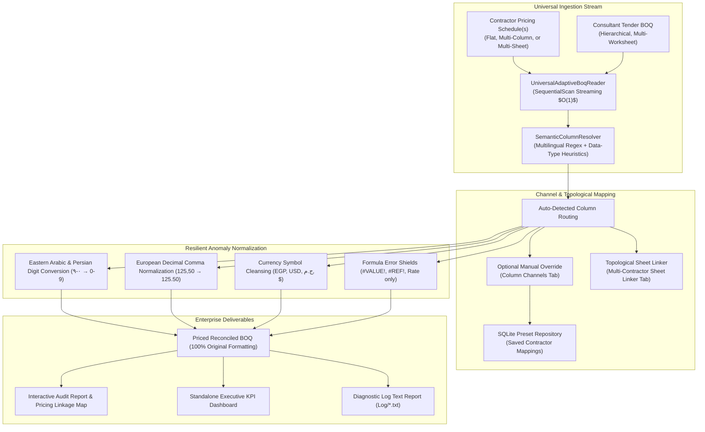

# Supported File Structures & Ingestion Standards

## 1. Executive Technical Overview

**SmartBOQ Enterprise v2.0** utilizes a fully adaptive, universal ingestion architecture engineered to parse arbitrary Bill of Quantities (BOQ) spreadsheets from contractors, engineering consultancies, and government authorities across the MENA region and worldwide.

Unlike rigid traditional estimating suites, SmartBOQ **does not enforce rigid templates, hardcoded column positions, or specific sheet names**.

```mermaid
flowchart TD
    subgraph Ingestion["Universal Ingestion Stream"]
        F1["Contractor Pricing Schedule(s)<br/>(Flat, Multi-Column, or Multi-Sheet)"] --> R1["UniversalAdaptiveBoqReader<br/>(SequentialScan Streaming $O(1)$)"]
        F2["Consultant Tender BOQ<br/>(Hierarchical, Multi-Worksheet)"] --> R1
        R1 --> S1["SemanticColumnResolver<br/>(Multilingual Regex + Data-Type Heuristics)"]
    end

    subgraph ChannelControl["Channel & Topological Mapping"]
        S1 --> C1["Auto-Detected Column Routing"]
        C1 --> C2["Optional Manual Override<br/>(Column Channels Tab)"]
        C1 --> C3["Topological Sheet Linker<br/>(Multi-Contractor Sheet Linker Tab)"]
        C2 --> C4["SQLite Preset Repository<br/>(Saved Contractor Mappings)"]
    end

    subgraph ResilientRecovery["Resilient Anomaly Normalization"]
        C1 --> N1["Eastern Arabic & Persian Digit Conversion (٠-٩ → 0-9)"]
        C1 --> N2["European Decimal Comma Normalization (125,50 → 125.50)"]
        C1 --> N3["Currency Symbol Cleansing (EGP, USD, ج.م, $)"]
        C1 --> N4["Formula Error Shields (#VALUE!, #REF!, Rate only)"]
    end

    subgraph Deliverables["Enterprise Deliverables"]
        N1 & N2 & N3 & N4 --> D1["Priced Reconciled BOQ (100% Original Formatting)"]
        D1 --> D2["Interactive Audit Report & Pricing Linkage Map"]
        D1 --> D3["Standalone Executive KPI Dashboard"]
        D1 --> D4["Diagnostic Log Text Report (Log/*.txt)"]
    end
```

---

## 2. Ingestion Engine: `UniversalAdaptiveBoqReader`

### Operational Characteristics:
* **Forward-Only Streaming**: Built upon `ExcelDataReader` utilizing low-level memory streams with sequential scanning. Does not load the entire Excel DOM into memory, maintaining a flat memory footprint (<200 MB RAM for 100,000+ rows).
* **Multi-Format Support**: Reads `.xlsx`, `.xlsm`, `.xlsb`, and legacy `.xls` (Excel 97–2003).
* **Dynamic Table Anchor Detection**: Automatically skips decorative preamble rows, project logos, and administrative metadata to lock onto the actual data table.

---

## 3. Intelligent Header Discovery: `SemanticColumnResolver`

The `SemanticColumnResolver` automatically identifies column roles across arbitrary languages (Arabic, English, French) and custom layouts:

### 3.1 Multilingual Header Canonical Dictionaries:
* **Item Code (`ItemCode`)**:
  `item`, `code`, `ref`, `pos`, `line`, `no.`, `كود`, `كود البند`, `رقم البند`, `م`, `مسلسل`, `بند`, `رقم`
* **Description (`Description`)**:
  `description`, `particular`, `statement`, `scope`, `work`, `specification`, `details`, `الوصف`, `البيان`, `تفاصيل`, `تفاصيل البند`, `بيان الأعمال`, `المواصفات`
* **Measurement Unit (`Unit`)**:
  `unit`, `uom`, `measure`, `unit of measure`, `unité`, `الوحدة`, `وحدة القياس`, `المقياس`
* **Quantity (`Quantity`)**:
  `quantity`, `qty`, `vol`, `volume`, `quantities`, `qte`, `الكمية`, `الكميات`, `إجمالي الكمية`
* **Unit Rate (`UnitRate`)**:
  `unit rate`, `unit price`, `rate`, `price`, `net rate`, `tender rate`, `p.u.`, `prix unitaire`, `سعر الوحدة`, `الفئة`, `فئة`, `السعر`, `سعر البند`, `سعر إفرادي`, `سعر مفرد`
* **Total Amount (`TotalAmount`)**:
  `total amount`, `total price`, `amount`, `total`, `net amount`, `montant`, `الإجمالي`, `المبلغ`, `القيمة`, `إجمالي القيمة`, `جملة`

### 3.2 Statistical Data-Type Heuristics (Headerless Fallback):
If a sheet lacks standard text headers, the resolver automatically executes statistical analysis:
1. **Description Column**: Column exhibiting the highest average string length (>60 characters) with zero numeric tokens.
2. **Unit Column**: Column exhibiting repetitive recognized engineering unit tokens (`M3`, `M2`, `LM`, `KG`, `TON`, `NO`, `LS`, `م3`, `م2`, `م.ط`, `عدد`, `مقطوعية`).
3. **Quantity & Rate Columns**: Evaluated based on numeric density and multiplication relationship to total amount columns.

---

## 4. Manual Channel Routing & Topological Sheet Linker

For non-standard or highly complex joint-venture submissions, the GUI provides absolute manual control:

### 4.1 Column Channels Tab (`ColumnChannelsTab`)
* Displays detected source and target columns side-by-side.
* Allows engineers to override any column assignment (Columns A through Z, AA, AB...) via interactive dropdowns.
* **Presets Engine**: Custom column configurations can be saved directly into SQLite (e.g. `Contractor_Orascom_Preset`) and recalled instantaneously.

### 4.2 Topological Sheet Linker Tab (`SheetLinkerTab`)
* Supports multi-source tendering where different contractors price different bills (e.g. Contractor A prices Civil, Contractor B prices MEP).
* Allows mapping specific consultant bill sheets to specific contractor source sheets or files.

---

## 5. Resilient Anomaly Normalization Pipeline

During ingestion, all cell values pass through automated normalization filters:

| Anomaly Type | Problem in Real BOQs | SmartBOQ Algorithmic Resolution |
| :--- | :--- | :--- |
| **Arabic-Indic Numerals** | Quantities or rates formatted as `١٢٥٠` or `٤٥٫٥٠`. | Automatically converted to Western European ASCII digits (`1250`, `45.50`). |
| **European Decimal Comma** | Rates formatted as `125,50` instead of `125.50`. | Auto-detected: single comma without 3-digit thousand chunk is converted to `.`. |
| **Currency Text in Numbers** | Cells containing `450 EGP`, `120 USD`, or `٥٠ ج.م`. | Currency tokens are stripped and assigned to the sheet currency bucket without altering the rate. |
| **Formula Errors** | Cells evaluating to `#VALUE!`, `#REF!`, `#DIV/0!`, `#N/A`. | Safely captured and treated as null rates without interrupting ingestion. |
| **Descriptive Rate Tokens** | Cells stating `Rate only`, `Included`, `بند محمل`. | Identified as non-numeric contractual notes and preserved without crashing the parser. |

---

## 6. Contractual Shielding Protocol

* **Provisional Sums (PS)**: Any sheet or line item containing `Provisional`, `PS`, or contractually shielded lump-sum allowances is locked. SmartBOQ **never overwrites** provisional sum rates, preserving client contingency allowances.
* **Variation Orders (VO)**: Line items present in the contractor file but absent from the official consultant tender schedule are classified as Variation Orders and reported in a dedicated section of the executive audit report.
